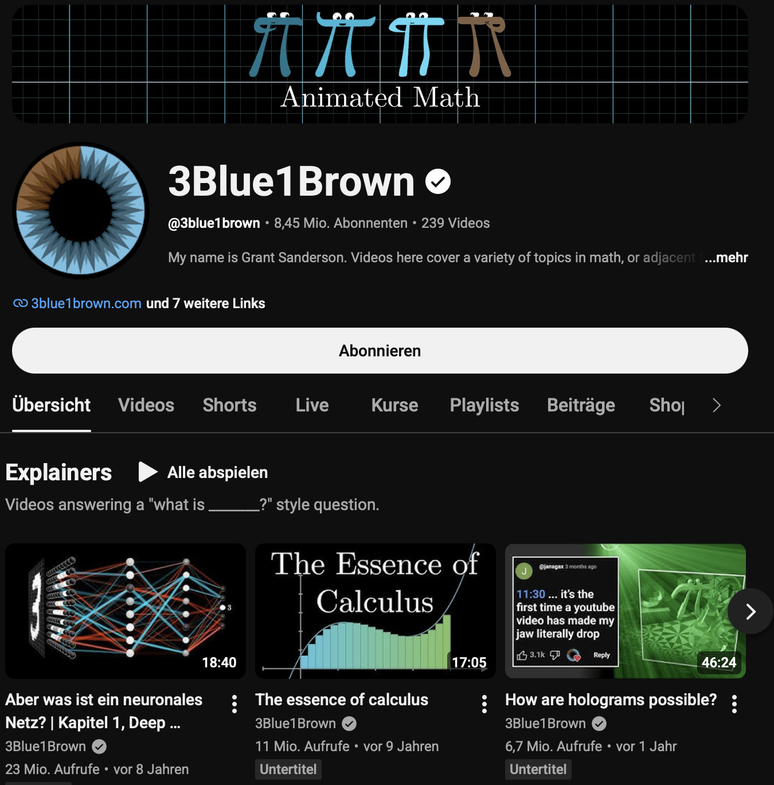

# Manim for Astro Visualizations {.center}

::: {.subtitle}
A compact introduction to making math/astro animations in Python.
:::

::: {.callout}
Outline:

- introduce Manim
- How to install
- Basic structure of a scene
- Render some examples
:::

## What is Manim?

Manim is a Python library for **programmatic animations**.


::: {.columns}

::: {.column style="width: 50%; font-size: 70%;" .fragment}

Good for:

- explaining geometry and math
- moving diagrams that stay precise
- reproducible outreach visuals
- animations that can be version-controlled

:::

::: {.column}

{width=80% .fragment}
:::

:::

## Core Idea

::: {.spaced-vertical}

`scene.py` → Manim render → `.mp4`, `.gif`, or image

Objects (`Mobject`s) live in a `Scene`. You create them, animate them, update them, and render frames.

:::


# Installation

## Recommended local setup

Use a project environment so your animations are reproducible.

```bash
# create a project folder
pixi init manim_env
cd manim_env

# add Manim to the local environment
pixi add manim

# check the installation
pixi run manim checkhealth
```

Note: there needs to be also a working LaTeX installation for some features, e.g., `Text` and `MathTex` and `ffmpeg` for video rendering.


::: {.section-label}
Here is the pixi.toml I used
:::

```{toml}
#| echo: true
#| code-fold: true
...
[dependencies]
python = ">=3.12,<3.13"
numpy = "*"
scipy = "*"
jupyter = "*"
ipykernel = "*"
matplotlib = "*"
astropy = "*"
manim = "*"
quarto = ">=1.9.38,<2"
av = "*"
ffmpeg = "*"
libjxl = ">=0.11,<0.12"
```

## Rendering basics

A Manim file contains one or more `Scene` classes.

```bash
manim -pql orbit_basics.py OrbitBasics
```

:::{.small .fragment}
Useful flags:

| Flag | Meaning |
|---|---|
| `-p` | open the video after rendering |
| `-ql` | low quality, fast preview |
| `-qm` | medium quality |
| `-qh` | high quality |
::: 

:::{.fragment}
Note: there are also VS Code extensions or Jupyter magicks, see below.
:::


# Manim mental model

## The smallest useful scene

```python
from manim import *

class HelloOrbit(Scene):
    def construct(self):
        star = Dot(ORIGIN, color=YELLOW)  # <1>
        orbit = Circle(radius=2.0, color=BLUE)
        label = Text("orbit", font_size=32).to_edge(UP)

        self.play(Write(label))  # <2>
        self.play(FadeIn(star), Create(orbit))
        self.wait()
```

1. Create static mobjects first so the scene geometry is explicit.
2. Animate in short, readable steps (`Write`, then `FadeIn`/`Create`).

A scene is just a Python class with a `construct()` method.

To render the scene from a Jupyter notebook, you can use this cell magic:

```python
%%manim -qm -v ERROR HelloOrbit

class HelloOrbit(Scene):
...
```


## Three concepts you will use often

:::: {.columns} 
::: {.column width="33%"}
::: {.astro-card}
**Mobjects**

Visual objects:

`Dot`, `Circle`, `Line`, `Text`, `Axes`, `VGroup`
<br/>
<br/>
<br/>
:::
:::

::: {.column width="33%"}
::: {.astro-card}
**Animations**

Actions over time:

`Create`, `FadeIn`, `Transform`, `MoveAlongPath`, `.animate`
:::
:::

::: {.column width="33%"}
::: {.astro-card}
**Updaters**

Frame-by-frame logic:

`ValueTracker`, `always_redraw`, `TracedPath`
:::
:::
::::

# Basic Examples

## **1. Creation and Transformation**

```python
class Basic(Scene):
    def construct(self):
        circle = Circle()
        square = Square()

        self.play(Create(circle))
        self.play(Transform(circle, square))
```

## 2. Moving things

```python
from manim.utils.rate_functions import ease_out_bounce

class Basic(Scene):
    def construct(self):
        circle = Circle().shift(4*LEFT)
        square = Square()

        self.play(Create(circle))
        self.play(circle.animate.shift(UP), run_time=4) # <1>
        self.play(circle.animate.move_to(UP)) # <2>
        self.play(circle.animate.to_edge(LEFT, buff=0), rate_func=ease_out_bounce) # <3>
        self.play(Create(square), circle.animate.next_to(square, RIGHT)) # <4>
        self.wait()

```
1. shift by X, note the runtime argument
2. move to X
3. to edge, usually there is some buffer space, being turned off here.
4. next to (note the buffer)

::: {.fragment}

**See also:**

```python
.shift(...)
.move_to(...)
.to_edge(...)
.to_corner(...)
.next_to(...)
.align_to(...)
.arrange(...)
```
:::


## 3. Changing Style


```python
class Basic(Scene):
    def construct(self):
        circle = Circle()
        self.play(Create(circle))
        self.play(circle.animate.set_color(RED).set_fill(RED, opacity=0.5))
        self.wait()
```

:::{.fragment}
**See also:**

```python
.set_color(...)
.set_fill(...)
.set_stroke(...)
.set_opacity(...)
.scale(...)
.rotate(...)
```
:::

## 4. ValueTracker

We create a `ValueTracker` to hold a single time-dependent parameter. The `always_redraw` wrapper keeps the dots in sync with the tracker. Thus, tracker is the single variable that drives the whole animation.

```python
class Basic(Scene):
    def construct(self):
        tracker = ValueTracker(0)

        dot1 = always_redraw(
            lambda: Dot().move_to(RIGHT * tracker.get_value())
        )
        dot2 = always_redraw(
            lambda: Dot().move_to(LEFT * tracker.get_value())
        )

        self.add(dot1, dot2)
        self.play(tracker.animate.set_value(3), run_time=3)
        self.wait()
        self.play(tracker.animate.set_value(5), run_time=3)
```

# Advanced Example 1: Orbit basics
## Orbit: what the viewer sees

A simple scene with:

- a star at the origin
- a circular orbit
- a planet driven by an angle
- a traced path
- a radius vector that updates every frame

Render:

```bash
cd examples
manim -pql orbit_basics.py OrbitBasics
```

## Orbit: the key pattern

```python
orbit_radius = 2.2
angle = ValueTracker(0)  # <1>

def planet_position():  # <2>
    a = angle.get_value()
    return orbit_radius * np.array([np.cos(a), np.sin(a), 0.0])

planet = always_redraw(  # <3>
    lambda: Dot(point=planet_position(), radius=0.09, color="#6EC6FF")
)

radius_line = always_redraw(
    lambda: Line(ORIGIN, planet_position(), color="#6EC6FF")
)

trail = TracedPath(planet.get_center, stroke_color="#6EC6FF")  # <4>
self.add(radius_line, trail, planet)

self.play(angle.animate.set_value(TAU), run_time=6, rate_func=linear)  # <5>
```

1. `ValueTracker` is the single time-dependent parameter.
2. Encapsulate position logic in a function of the tracker.
3. `always_redraw` keeps the planet synced with every frame.
4. `TracedPath` leaves a visible orbital history.
5. Animate the tracker to drive the whole system.

::: {.small}
File: `examples/orbit_basics.py`
:::

# Example 2: Exoplanet transit

## Transit: geometry plus light curve

This example connects two things students often see separately:

1. a planet crossing a stellar disk
2. a dip in relative flux

Render:

```bash
cd examples
manim -pql exoplanet_transit.py ExoplanetTransit
```

## Transit: toy model and moving point

```python
def relative_flux(phase: float) -> float:
    """Toy transit model: flat-ish dip near phase zero."""
    ... # <1>

phase = ValueTracker(-1.15)  # <2>

curve = axes.plot(  # <3>
    relative_flux,
    x_range=[-1.15, 1.15, 0.01],
    color="#6EC6FF",
    stroke_width=4,
)

moving_point = always_redraw(  # <4>
    lambda: Dot(
        point=axes.c2p(phase.get_value(), relative_flux(phase.get_value())),
        radius=0.055,
        color="#FFFFFF",
    )
)
```

1. Any function that takes the phase and returns a flux can be used.
2. A single `phase` tracker drives geometry and photometry.
3. Plot the full model once as the static context.
4. Redraw only the marker to show current phase/flux.

::: {.small}
File: `examples/exoplanet_transit.py`
:::

## Transit -- Animation

```python
self.play(Write(title)) # <1>
self.play(FadeIn(star), FadeIn(star_label), FadeIn(planet_label))  # <2>
self.play(Create(axes), Write(x_label), Write(y_label), Create(curve)) # <3>
self.add(planet, moving_point)  # <4>
self.play(phase.animate.set_value(1.15), run_time=6, rate_func=linear) # <5>
self.play(FadeIn(explanation, shift=UP * 0.2))
self.wait()
```

1. This is the fancy "writing" animation.
2. Fade all those in at once
3. Next step: `Create` will animate a "build up" of the curve.
4. Add will just appear them instantly
5. The main animation: move the phase tracker from start to end. The `always_redraw` objects will follow along. The rate function `linear` is uniform motion.

# Example 3: Stellar parallax

## Parallax: outreach version

This scene shows a nearby star shifting against distant background stars as Earth moves around the Sun.

Render:

```bash
cd examples
manim -pql stellar_parallax.py StellarParallax
```

The example is qualitative, not a full astrometric model.

## Parallax: apparent motion

```python
theta = ValueTracker(0)  # <1>
base = np.array([0.0, 0.45, 0.0])  # <2>

def apparent_shift():  # <3>
    return np.array([
        0.72 * np.cos(theta.get_value()),
        0.25 * np.sin(theta.get_value()),
        0.0,
    ])

nearby_star = always_redraw(  # <4>
    lambda: Dot(point=base + apparent_shift(), radius=0.09, color="#FDB813")
)
trail = TracedPath(nearby_star.get_center, stroke_color="#FDB813")
```

1. `theta` parameterizes Earth position through the year.
2. `base` is the mean position of the nearby star on screen.
3. Apparent shift models the parallax wobble.
4. Redraw the star from the current shift and trace its path.

::: {.small}
File: `examples/stellar_parallax.py`
:::

# Example 4: H-R diagram

## H-R diagram: animated data story

The example uses stylized points, but the pattern works for real catalogs:

1. load arrays
2. map values to axes
3. group related points
4. animate the story in layers

Render:

```bash
cd examples
manim -pql hr_diagram.py HRDiagram
```

## H-R diagram: axes and point groups

```python
axes = Axes(  # <1>
    x_range=[-2.5, 2.5, 1],
    y_range=[-4.2, 4.2, 2],
    x_length=7.2,
    y_length=4.6,
    tips=False,
)

xs = np.linspace(-2.15, 2.15, 20)  # <2>
main_sequence = VGroup(
    *[
        dot_at(x, -1.15 * x + 0.15 + 0.20 * np.sin(3 * x), star_color(x))
        for x in xs
    ]
)

self.play(LaggedStart(*[FadeIn(dot, scale=0.5) for dot in main_sequence]))  # <3>
```

1. Set axes first so all later points have clear meaning.
2. Map sampled values into a stylized main sequence.
3. `LaggedStart` reveals structure progressively for narration.

::: {.small}
File: `examples/hr_diagram.py`
:::

## H-R diagram: next steps with real data

Replace the toy arrays with catalog data, for example:

```python
# sketch only: keep data loading separate from scene logic
import pandas as pd

catalog = pd.read_csv("nearby_stars.csv")
color = catalog["bp_rp"].to_numpy()
abs_mag = catalog["M_G"].to_numpy()

points = VGroup(*[
    Dot(axes.c2p(c, -m), radius=0.025)
    for c, m in zip(color, abs_mag)
])
```

::: {.callout}
Manim is not a replacement for scientific plotting. It is a presentation layer for explaining the plot.
:::

# How to structure your own animation

## A practical workflow

1. Sketch the story in one sentence.
2. Make the static objects first.
3. Add one moving quantity with `ValueTracker`.
4. Use `always_redraw` only where the object truly changes.
5. Render with `-ql` until the timing works.
6. Render final clips with `-qh` or `-qk` only at the end.

## Debugging tips

- Use `Text` labels during development, remove later.
- Keep functions small: `make_axes()`, `make_star_field()`, `make_light_curve()`.
- Prefer named variables over long one-line animations.
- If rendering is slow, preview shorter segments or fewer points.
- Avoid LaTeX until the core animation works.

# Wrap-up

## What to try after Code Coffee

- Change the orbit to an ellipse.
- Add eccentric anomaly / true anomaly labels.
- Add limb darkening to the transit example.
- Load a real Gaia subset for the H-R diagram.
- Export a short animation for a lecture slide or outreach post.

::: {.callout}
Start small: one scene, one moving parameter, one message.
:::

## Files in this Quarto project

```text
manim_quarto/
├── _quarto.yml
├── manim.qmd
├── styles.css
├── README.md
└── examples/
    ├── orbit_basics.py
    ├── exoplanet_transit.py
    ├── stellar_parallax.py
    ├── hr_diagram.py
    └── render_all_examples.sh
```

Render the slide deck:

```bash
quarto preview manim.qmd
```

Render the animations:

```bash
cd examples
bash render_all_examples.sh
```
